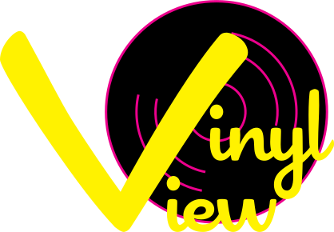
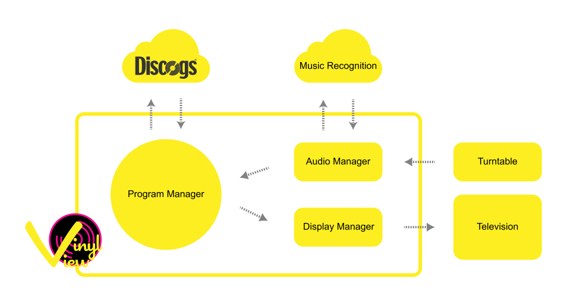
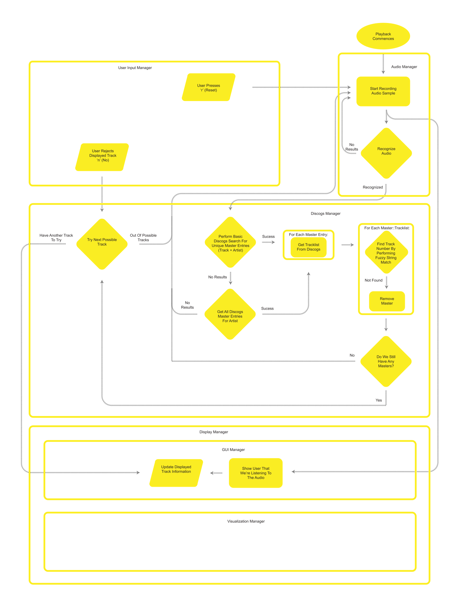

 

I've been working on a new project. Vinyl View is a real time visualizer for turntables. It samples the audio and sends it to a recognition service, then references [Discogs][discogs] in order to show the user album art and some metadata for the music they are currently listening to.

That's the overall structure of the program. At the moment, Vinyl View can record audio to a wav file and upload it to the recognition service. [ACRCloud][acrcloud] is the service I went with and it yields some pretty accurate results. I started running into some headaches when trying to cross reference my recognized metadata with Discogs. After re-writing chunks of code several times, I decided it's time to form a real plan.

That is work in progress flowchart for the program. Pen, meet paper.

[discogs]: https://www.discogs.com/
[acrcloud]: https://acrcloud.com/