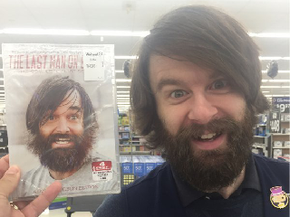

<div class="youtube">
	<iframe width="100%" height="100%" src="https://www.youtube.com/embed/ZAk2-fZf-rk" frameborder="0" allow="accelerometer; autoplay; clipboard-write; encrypted-media; gyroscope; picture-in-picture" allowfullscreen></iframe>
</div>
<br />

About 7 years ago, I was really into the idea of coding my own N64 game.
I took a deep dive into the tools that I could find and the limited documentation that came with it.
The first major hurdle I encountered was using my own textures. There are some sample textures in the SDK, but they are in an archaic format.
Many times, the documentation refers to a small command line program named ***rgb2c*** that is used to convert the already archaic images into a compatible format. 

<span class="more"></span>

### RGB2C Doesn't Exist!

It doesn't appear to exist anymore, that is. I've scoured the internet for any trace of this elusive program but to no avail.
I decided to write my own converter and had decent success. In 2016 [I uploaded it to GitHub][png2c] and about a year ago I decided to get back into my N64 development journey.
The first iteration of my code used a library called [CImg][cimg] to access the pixel data of JPEGs and PNGs and that worked for the time.
When I picked the program back up, I quickly realized that transparency wasn't working in my textures. 

[Apparently][cimg png stackoverflow], CImg is capable of reading in transparency values from a PNG, but only by also using [libPNG][libpng].
I wasn't going that road, so I scrapped CImg and rewrote the entire program with libPNG.

### New Functionality

After I got the new code working with transparency, I found a new problem. I was attempting to create a menu with a full screen background image, and I ran into a wall.
The N64's limited texture memory simply couldn't handle my 320x240 pixel image.
I modified [PNG2C][png2c] to break up the large image into smaller textures that were 32x32 pixels each. In addition, vertex data is provided to make it easy to use in the game program.
The output data consists of arrays of vertex data and arrays of pixel data to texturize said vertices. Each 32x32 chunk is simply a square drawn in 3D space. No one will ever know it isn't drawn in 2D.

### Using The New Program

To get started with the new updates, I took the liberty of shrinking my favorite picture of myself down to 320x240 pixels and renaming it ***full_screen_image.png***.



Converting it into an N64 compatible texture is easy as cucumber pie. Just issue the following command.

```sh
./png2c full_screen_image.png -f
```

This command generates a new file called ***full_screen_image.h*** and it is packed with all the data we need to draw a full screen image on the N64.
I'm not giving out my source code for the N64 program just yet, but I have compiled a [sample rom][romLink] to show that it does, indeed perform as expected.
[Download the rom][romLink] and try it out on your favorite N64 emulator. I have only tested it on [Project64][pj64], so your mileage may vary. It also runs on actual hardware, if you're wondering.


[romLink]: ./jason_last_man.n64
[pj64]: https://www.pj64-emu.com/
[png2c]: https://github.com/selfVSmind/png2c
[cimg]: https://cimg.eu/
[libpng]: http://www.libpng.org/pub/png/libpng.html
[cimg png stackoverflow]: https://stackoverflow.com/questions/12084048/how-to-open-png-with-cimg-library-without-losing-alpha-channel